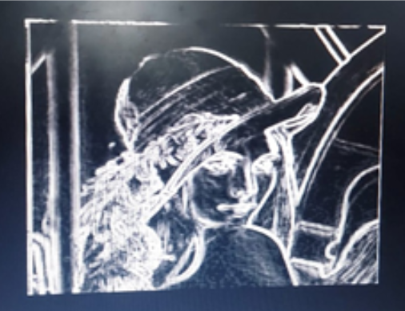
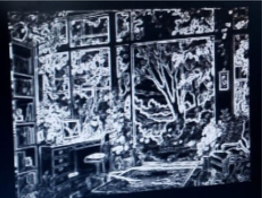

# 🚀 Hardware Implementation of Sobel Edge Detection on FPGA

> Real-time image processing using FPGA with VGA output  
> Verilog-based pipelined architecture for high-speed edge detection  

---

# 📸 Output Preview

## Original Image vs Sobel Edge Output

| Original Image | Edge Detected Output |
|---|---|
|  |  |

---

## Scene Image vs Edge Output

| Original Scene | Edge Detected Scene |
|---|---|
|  |  |

---

## 🖼️ Example Outputs

### Lena Image
<p align="center">
  
  
</p>

### Nature Scene
<p align="center">
  
  
</p>

---

## 📌 Overview

This project implements a **Sobel Edge Detection system on FPGA** using Verilog HDL. The system processes a grayscale image stored in on-chip memory (BRAM) and displays the edge-detected output on a VGA monitor.

Unlike software-based approaches, this design performs **parallel hardware computation**, enabling fast and efficient image processing directly on FPGA.

---

## 🎯 Objective

- Implement Sobel edge detection in hardware  
- Process image data efficiently using FPGA  
- Achieve real-time performance  
- Display output using VGA interface  

---

## ⚡ Key Features

- Real-time edge detection  
- Pixel-by-pixel processing  
- Pipelined hardware architecture  
- VGA output display (640×480)  
- Efficient memory usage using BRAM  
- Modular and scalable design  

---

## 🧠 Important Concepts Used

### 🔹 Real-Time Processing

Real-time means the system processes and displays data **immediately as it is being read**, without noticeable delay.

In this project, once the pipeline is filled, the FPGA processes **one pixel per clock cycle**, and the output is displayed continuously on the VGA screen.

---

### 🔹 Streaming Dataflow (Hardware Perspective)

Streaming means data flows **continuously through different modules** without storing the entire image.

In this design:

- Pixels are read sequentially from BRAM  
- Passed through line buffer → Sobel → VGA  
- Each module processes data and forwards it instantly  

This avoids full-frame storage and improves speed and efficiency.

---

## 🏗️ System Architecture

The system consists of the following major components:

- **BRAM** → Stores grayscale image  
- **Line Buffer** → Generates 3×3 pixel window  
- **Sobel Module** → Computes edges  
- **VGA Controller** → Displays output  

### Data Flow

```text
BRAM → Pixel Register → Line Buffer → Sobel → VGA Output
```

---

## ⚙️ Working

1. Image is converted to grayscale and resized to 256×256  
2. Image is stored in BRAM using a COE file  
3. VGA controller generates pixel coordinates  
4. Pixel values are read from memory  
5. Line buffer forms 3×3 window  
6. Sobel module computes edge intensity  
7. Output is displayed on VGA  

After initial delay, the system continuously processes pixels and displays results in real time.

---

## 🧩 Modules Description

| Module | Function |
|------|--------|
| Top Module | Integrates all components |
| VGA Controller | Generates sync signals and coordinates |
| Line Buffer | Creates 3×3 pixel window |
| Sobel Module | Computes edge gradients |
| BRAM | Stores input image |

---

## 🛠️ Tools & Technologies

| Component | Details |
|---|---|
| FPGA Board | Nexys 4 DDR (Artix-7) |
| Software | Xilinx Vivado 2023.2 |
| HDL | Verilog |
| Python Libraries | OpenCV, NumPy |
| Display Interface | VGA |

---

## 🖼️ Image Preprocessing

Before loading into FPGA:

- Convert image to grayscale  
- Resize image to 256×256  
- Convert image into COE format  
- Load COE into BRAM IP  

---

## ▶️ How to Run

### 1️⃣ Create Vivado Project

- Open Vivado  
- Select Nexys 4 DDR board  

### 2️⃣ Add Source Files

- Add Verilog modules  
- Add XDC constraints  

### 3️⃣ Configure BRAM

- Generate BRAM IP  
- Load COE initialization file  

### 4️⃣ Build Project

- Run synthesis  
- Run implementation  
- Generate bitstream  

### 5️⃣ Program FPGA

- Connect board  
- Program FPGA  
- Connect VGA monitor  

### 6️⃣ Observe Output

Edge-detected image should appear on the VGA display.

---

## 📊 Results

✅ Edge-detected image displayed successfully on VGA  
✅ Clear boundary detection  
✅ Stable output without flickering  
✅ Proper synchronization between modules  

The FPGA processes image data continuously using streaming architecture.

---

## ⚠️ Challenges Faced

| Problem | Solution |
|---|---|
| BRAM latency | Added register stage |
| Line buffer initialization | Used valid signals |
| VGA timing mismatch | Synchronized pixel clock |
| Pipeline delay | Verified using simulation |

---

## 🚀 Future Improvements

- Pipeline delay compensation  
- RGB image support  
- Canny edge detection  
- Live camera input (OV7670)  
- Higher resolution processing  
- AXI-stream optimization  

---


## ⭐ Summary

This project demonstrates how FPGA can be used for **high-speed real-time image processing** using a pipelined and streaming architecture.

It provides a strong foundation for:

- Hardware acceleration  
- FPGA-based computer vision  
- Real-time embedded image processing  
- Edge AI systems  

---

## ⭐ Support

If you found this project useful, consider giving the repository a ⭐ on GitHub!
